# Lobable Architecture Suggestions: Auth & Database Design

This document details suggestions and structural plans for implementing user authentication, storing sandboxes/projects, and persisting/summarizing chat histories.

---

## 1. Core Architecture Strategy (PostgreSQL vs. Object Store / S3)

### Trade-offs: Database vs. Object Store (S3) vs. Local Files

| Metric | Local Disk File | Object Store (e.g., S3) | Database (PostgreSQL JSONB) |
| :--- | :--- | :--- | :--- |
| **Scalability** | ❌ **Low**: Tied to a single instance disk. |  **High**: Global access, virtually unlimited storage capacity. |  **High**: Centralized state, easy clustering/scaling. |
| **Latency / TTFB** |  **Instant**: Sub-millisecond reads/writes. | ❌ **High (50-100ms)**: High request overhead for active transactional updates. |  **Very Fast (1-5ms)**: Highly optimized query speeds. |
| **Access Granularity** | ⚠️ **Full File Only**: Must load the whole file into memory. | ❌ **Full Object Only**: Cannot easily append or query a subset of messages without downloading the entire JSON file. |  **Fine-grained**: Query, filter, or update individual chat rows dynamically. |
| **Cost** |  **Free** (until disk is full). |  **Extremely Cheap**: Best cost-efficiency for cold archive storage. | ⚠️ **Moderate**: Storage pricing increases as indexing/tables grow. |

---

### Recommended Production Design Pattern: Active/Archive Hybrid

For a production-grade system, using an object store (S3) *directly* as the transaction log for live chat turns creates high latency (due to network round-trips to read/write/re-upload JSON files on every message). 

Instead, implement a **Hybrid Active-to-Cold Archive Lifecycle**:

```mermaid
sequenceDiagram
    participant UI as Client UI
    participant Server as Express Server
    participant DB as PostgreSQL
    participant S3 as AWS S3 Object Store
    
    rect rgb(30, 30, 30)
    Note over UI, DB: Active Stage (Live Chat)
    UI->>Server: Send new prompt
    Server->>DB: Insert message row (low latency)
    Server->>DB: Fetch last N messages for LLM context
    Server->>UI: Stream LLM response
    Server->>DB: Insert LLM response row
    end
    
    rect rgb(20, 40, 20)
    Note over Server, S3: Archive Stage (Inactivity / Compaction)
    Server->>DB: Check for inactive projects (> 30 days)
    Server->>DB: Fetch full historical transcript
    Server->>S3: Upload transcript.json to S3 bucket
    Server->>DB: Delete individual message rows (Keep metadata/summary only)
    end
```



1. **Active State (PostgreSQL):** While the user is actively building and updating, all messages (system, tool, user, assistant) are written to PostgreSQL. This guarantees low-latency page loads and rapid real-time updates.
2. **Cold Archiving (S3):** When a project becomes inactive (e.g. 14 or 30 days since last update) or when the project is closed, the backend bundles the full database chat history into a single compressed JSON file, uploads it to S3, and purges the granular rows from PostgreSQL (retaining only the project summary or metadata).
3. **Restoring History:** If a user returns to an archived project, the server fetches the JSON file from S3, bulk-inserts it back into PostgreSQL (or serves it directly), and resumes the active state.

---

## 2. Recommended Database Schema (PostgreSQL)

You can run a local PostgreSQL instance using Docker and interact with it using TypeScript ORMs like **Prisma** or **Drizzle ORM**.

```sql
-- 1. Users Table for Auth
CREATE TABLE users (
    id UUID PRIMARY KEY DEFAULT gen_random_uuid(),
    email VARCHAR(255) UNIQUE NOT NULL,
    password_hash VARCHAR(255) NOT NULL,
    created_at TIMESTAMP WITH TIME ZONE DEFAULT CURRENT_TIMESTAMP
);

-- 2. Projects/Sandboxes Table
CREATE TABLE projects (
    id UUID PRIMARY KEY DEFAULT gen_random_uuid(),
    user_id UUID NOT NULL REFERENCES users(id) ON DELETE CASCADE,
    name VARCHAR(255) NOT NULL,
    sandbox_id VARCHAR(255), -- Stores the active E2B sandbox session ID
    created_at TIMESTAMP WITH TIME ZONE DEFAULT CURRENT_TIMESTAMP
);

-- 3. Messages Table (Stores chat log & LLM payloads)
CREATE TABLE messages (
    id UUID PRIMARY KEY DEFAULT gen_random_uuid(),
    project_id UUID NOT NULL REFERENCES projects(id) ON DELETE CASCADE,
    role VARCHAR(50) NOT NULL, -- 'user', 'assistant', 'system', 'tool', 'status'
    content TEXT,
    tool_calls JSONB, -- Stores array of function tool calls
    correlation_id VARCHAR(255), -- Used for user clarification queries
    created_at TIMESTAMP WITH TIME ZONE DEFAULT CURRENT_TIMESTAMP
);
```

---

## 3. Implementation Workflow

### Step 1: User Auth (Express + Session/JWT)
1. Implement a `/auth/signup` and `/auth/login` endpoint on the backend.
2. Hash passwords using `bcrypt` or `argon2`.
3. Issue a signed HTTP-only JWT Cookie to persist user session on the frontend.

### Step 2: Persist Sandboxes
1. When creating a project in `/agent/create`, write a new row to `projects` associating the project with the logged-in `user_id`.
2. Save the resolved `sandboxId` directly into that row. When a user reconnects, retrieve the existing sandbox ID instead of spinning up a new container.

### Step 3: Handle Chats & LLM Compaction
1. **Writing to DB:** For every prompt and assistant answer, save a new entry to the `messages` table.
2. **Re-connection (UI Load):** Fetch user/assistant messages only:
   ```sql
   SELECT role, content, correlation_id, created_at
   FROM messages
   WHERE project_id = $1 AND role IN ('user', 'assistant')
   ORDER BY created_at ASC;
   ```
3. **Context Feeding & Compaction:** Before querying OpenAI or Groq:
   * Load the full transcript from `messages` (including `tool` responses).
   * Count the context tokens.
   * If tokens exceed limit, run a background summarization agent to condense older messages, write a single `system` summary message, mark archived rows as `summarized = true`, and append the last 5-10 uncompressed turns.

---

## 4. Suggested Tech Stack
*   **Database:** PostgreSQL (running in Docker `postgres:alpine`)
*   **Caching/In-Memory:** Redis (running in Docker `redis:alpine` - optional)
*   **Authentication:** JWT middleware or `lucia` auth
*   **ORM:** Drizzle ORM or Prisma

---

## 5. Caching Strategy: Using Redis for Active Conversations

Using **Redis** as a temporary in-memory buffer during an active session, then flushing to **PostgreSQL** once the conversation "completes", is a common scalability pattern (Write-Back Caching). 

Here is how this approach compares to direct DB writes and how to address its specific design challenges.

### Trade-offs: Redis Caching vs. Direct DB Writes

| Metric | Redis Caching (Write-Back) | Direct PostgreSQL Writes |
| :--- | :--- | :--- |
| **Write Latency** |  **Sub-millisecond**: Ultra-fast memory operations. |  **Fast (1-5ms)**: Slightly more disk/network I/O. |
| **Infrastructure Complexity**| ❌ **High**: Requires running, configuring, and monitoring both PostgreSQL and Redis. |  **Low**: Single database dependency to configure and maintain. |
| **Resilience to Crash** | ❌ **Risk of Data Loss**: Active session history is lost if the Redis container restarts before flushing to Postgres (unless AOF persistence is enabled). |  **Highly Durable**: Writes are safely committed to disk immediately. |
| **Stale Logs Cleanup** |  **Automatic**: Native key expiration (TTL) handles abandoned or disconnected sessions automatically. | ❌ **Manual**: Requires running background cron cleaning queries. |

---

### Key Architectural Challenges of Redis Caching

#### 1. Defining "Conversation Completion"
In transactional settings (like e-commerce checkouts), there is a clear start and end. But for an AI agent software builder (like Lobable), conversations are open-ended.
*   **The Heuristic Solution:**
    *   **Activity Timeout (Inactivity Flush):** Keep the conversation session in Redis with a 30-minute expiration. Every time a new prompt is received, extend the TTL. If no action occurs for 30 minutes, a background worker triggers, flushes the final compiled history into PostgreSQL, and deletes the Redis keys.
    *   **Explicit Saving:** Flush the chat log from Redis to Postgres every time a sub-agent completes a full cycle (e.g. build passes and returns response).

#### 2. Re-connection Synchronization
If a user closes their tab mid-compilation and reconnects:
1. The server checks Redis first: `EXISTS project:id:chats`.
2. If found, it serves active chats directly from memory.
3. If not found (evicted/expired), the server falls back to PostgreSQL, retrieves the latest state, populates Redis, and serves it.

### Recommendation
*   **For MVPs / Early Stage:** Start with **Direct PostgreSQL Writes**. PostgreSQL can handle thousands of concurrent queries without issue, and keeping a single database avoids data sync bugs or session loss.
*   **For Scale (High Traffic & Real-time Pub/Sub):** Introduce **Redis** to store temporary intermediate streaming step logs (like compiler logs and build steps), while keeping final user and assistant messages in **PostgreSQL**.
